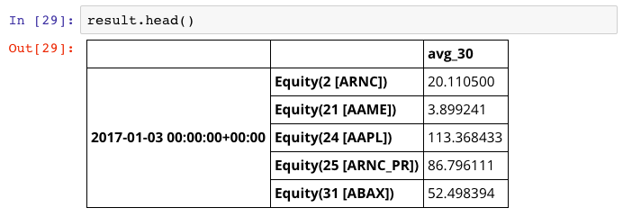
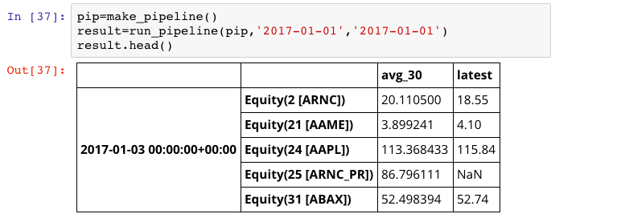
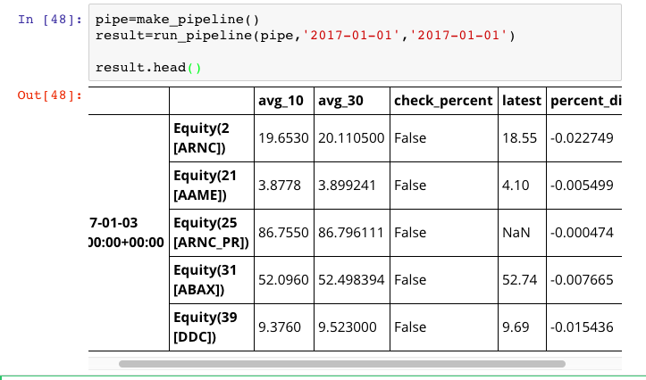
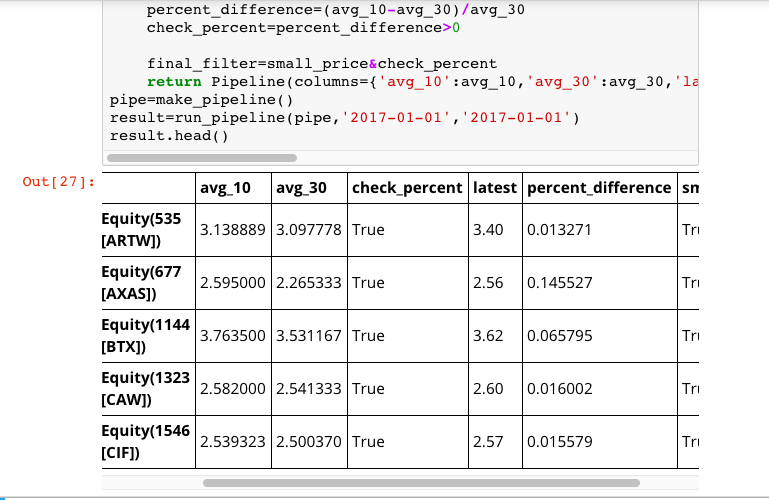

# Python金融学第10课----pipeline的使用
本文主要讲一下pipeline的使用方法，pipeline类似于机器学习当中的管道，数据经过这个管道的处理之后，就会返回归整化的数据。
# Pipeline(管道)
pipeline可以根据传入的pipeline对象和起始还有截止日期返回一个多层索引的对象,pipeline是根据传入的数据data经过factor对data转化后返回的数据结构，然后run_pipeline可以根据传入的pipe和日期去取对应的数据并进行加工返回最后的dataframe。

```
#首先导入模块
from quantopian.pipeline import Pipeline
#定义返回的pipeline对象，它规定了返回的dataframe的列数据
def make_pipeline():
	return Pipeline()
#导入run_pipeline模块，这个模块能够传入日期和pipeline对象，返回对应的数据结构，也就是dataframe
from quantopian.research import run_pipeline
pip=make_pipeline()#定义了一个pipeline对象
result=run_pipeline(pip,'2017-01-01','2017-01-01')#传入了pipeline对象以及起止日期
result.head()
```

在这里只有两层索引而没有数据，因为我们在make_pipeline这个函数当中没传入数据，也没有对如何加工数据进行定义。
# Data
我们传入一个数据，是关于股本价格的变化情况的数据。
```
from quantopian.pipeline.data.builtin import USEquityPricing
```
# Factor
factor是函数，传入股本的信息asset和相关的时间戳，返回这个factor函数处理后的数值。factor有多个函数，比如有求移动平均的simplemovingaverage，有求权值的平均值EWMA等。
```
#导入模块
from quantopian.pipeline.factors import SimpleMovingAverage,EWMA
#我们在这里定义pipeline，用来求30天的股本的移动平均值
def make_pipeline():
	avg_30=SimpleMovingAverage(inputs=[USEquityPricing.close], window_length=30)
	return Pipeline(columns={'avg_30':avg_30})#定义返回的dataframe结构
pip=make_pipeline()#定义一个pipeline对象
result=run_pipeline(pip,'2017-01-01','2017-01-01')运行pipeline对象
result.head()
```

可以看到，结果返回了对每个股本进行求30天的移动平均值的一列。
我们接下来多增加一列，列出各个股本最新的收盘价格。
```
def make_pipeline():
	avg_30=SimpleMovingAverage(inputs=[USEquityPricing.close], window_length=30)
	latest=USEquityPricing.close.latest
    return Pipeline(columns={'avg_30':avg_30, 'latest':latest})
pip=make_pipeline()
result=run_pipeline(pip,'2017-01-01','2017-01-01')
result.head()
```

# Factor进行组合
我们可以对factor的函数计算结果另外进行计算其他的数。
```
def make_pipeline():
    avg_10=SimpleMovingAverage(inputs=[USEquityPricing.close],window_length=10)
    avg_30=SimpleMovingAverage(inputs=[USEquityPricing.close],window_length=30)
    latest=USEquityPricing.close.latest
    percent_difference=(avg_10-avg_30)/avg_30
    return Pipeline(columns={'avg_10':avg_10,'avg_30':avg_30,'latest':latest,'percent_difference':percent_difference})
pipe=make_pipeline()
result=run_pipeline(pipe,'2017-01-01','2017-01-01')
result.head()
```

# 过滤和筛选
我们还可以添加值为布尔值的列，以进行筛选。
```
def make_pipeline():
    avg_10=SimpleMovingAverage(inputs=[USEquityPricing.close],window_length=10)
    avg_30=SimpleMovingAverage(inputs=[USEquityPricing.close],window_length=30)
    latest=USEquityPricing.close.latest
    percent_difference=(avg_10-avg_30)/avg_30
    check_percent=percent_difference>0
    return Pipeline(columns={'avg_10':avg_10,'avg_30':avg_30,'latest':latest,'percent_difference':percent_difference, 'check_percent':check_percent})
```

## 筛选布尔值为True的行
筛选只用在pipeline当中的screen参数当中传入对应的布尔值的列即可。
```
def make_pipeline():
    avg_10=SimpleMovingAverage(inputs=[USEquityPricing.close],window_length=10)
    avg_30=SimpleMovingAverage(inputs=[USEquityPricing.close],window_length=30)
    latest=USEquityPricing.close.latest
    percent_difference=(avg_10-avg_30)/avg_30
    check_percent=percent_difference>0
    return Pipeline(columns={'avg_10':avg_10,'avg_30':avg_30,'latest':latest,'percent_difference':percent_difference, 'check_percent':check_percent},screen=check_percent)
```

## 相反筛选
在screen参数里面传的列名前面加上~符号。
```
def make_pipeline():
    avg_10=SimpleMovingAverage(inputs=[USEquityPricing.close],window_length=10)
    avg_30=SimpleMovingAverage(inputs=[USEquityPricing.close],window_length=30)
    latest=USEquityPricing.close.latest
    percent_difference=(avg_10-avg_30)/avg_30
    check_percent=percent_difference>0
    return Pipeline(columns={'avg_10':avg_10,'avg_30':avg_30,'latest':latest,'percent_difference':percent_difference, 'check_percent':check_percent},screen=~check_percent)
```

# 合并过滤
我们可以用多个过滤条件，用&等符号来连接。
```
def make_pipeline():
    avg_10=SimpleMovingAverage(inputs=[USEquityPricing.close],window_length=10)
    avg_30=SimpleMovingAverage(inputs=[USEquityPricing.close],window_length=30)
    latest=USEquityPricing.close.latest
    percent_difference=(avg_10-avg_30)/avg_30
    check_percent=percent_difference>0
    small_price=latest<5
    final_filter=small_price&check_percent
    return Pipeline(columns={'avg_10':avg_10,'avg_30':avg_30,'latest':latest,'percent_difference':percent_difference, 'check_percent':check_percent,'small_price':small_price},screen=final_filter)
pipe=make_pipeline()
result=run_pipeline(pipe,'2017-01-01','2017-01-01')
result.head()
```

# Mask(对数据前筛选)
有时候我们只是想对一部分符合条件的数据进行筛选，所以这个时候我们用mask方法，只有一部分满足要求的数据才会进入pipeline进行计算。
传入到factor当中的mask参数当中，也是判断语句返回的布尔值。
```
def make_pipeline():
	latest=USEquityPricing.close.latest
	small_price=latest<5
    avg_10=SimpleMovingAverage(inputs=[USEquityPricing.close],window_length=10, mask=small_price)
    avg_30=SimpleMovingAverage(inputs=[USEquityPricing.close],window_length=30, mask=small_price)
    
    percent_difference=(avg_10-avg_30)/avg_30
    check_percent=percent_difference>0
    
    final_filter=small_price&check_percent
    return Pipeline(columns={'avg_10':avg_10,'avg_30':avg_30,'latest':latest,'percent_difference':percent_difference, 'check_percent':check_percent,'small_price':small_price},screen=final_filter)
pipe=make_pipeline()
result=run_pipeline(pipe,'2017-01-01','2017-01-01')
result.head()
```

# 分类器(classifier)
分类器是用来将股本集合分类的，输出的是每个股本的标签数字，或者是标签文本。
```
#导入相关模块
from quantopian.pipeline.data import morningstar
from quantopian.pipeline.classifiers.morningstar import Sector
morningstar_sector = Sector()
exchange = morningstar.share_class_reference.exchange_id.latest
```
## 分类器方法
- eq
- isnull
- startswith

eq的作用：
Signature: exchange.eq(other)
Docstring:
Construct a Filter returning True for asset/date pairs where the output of ``self`` matches ``other``.
从上面可以看到eq的作用就是为了match输入值
```
def make_pipeline():
	latest=USEquityPricing.close.latest
	small_price=latest<5
    avg_10=SimpleMovingAverage(inputs=[USEquityPricing.close],window_length=10, mask=small_price)
    avg_30=SimpleMovingAverage(inputs=[USEquityPricing.close],window_length=30, mask=small_price)
    NYS_filter=exchange.eq('NYS')
    percent_difference=(avg_10-avg_30)/avg_30
    check_percent=percent_difference>0
    
    final_filter=small_price&NYS_filter
    return Pipeline(columns={'avg_10':avg_10,'avg_30':avg_30,'latest':latest,'percent_difference':percent_difference, 'check_percent':check_percent,'small_price':small_price},screen=final_filter)
pipe=make_pipeline()
result=run_pipeline(pipe,'2017-01-01','2017-01-01')
result.head()
```

# Quantopian IDE实现pipeline
```
from quantopian.pipeline import Pipeline
from quantopian.algorithm import attach_pipeline, pipeline_output
#初始化，定义
def initialize(context):
	pipeline=make_pipeline()
	attach_pipeline(pipeline, 'pipeline')将pipeline对象和'pipeline'这个名字连接起来
def make_pipeline():#定义make_pipeline这个函数
	return Pipeline()
def before_trading(context, data):
	#我们在交易前，先把pipeline要输出的dataframe存储到context这个字典当中
	context.output=pipeline_output('pipeline')
```

`initilize`是在初始化`pipeline`，而后面的`before_trading`是在调用这个初始化好的`pipeline`结构对象，类似于python当中的类。如果把`pipeline_output`放在了`initialize`里面的话，就会提示是还没初始化就调用。